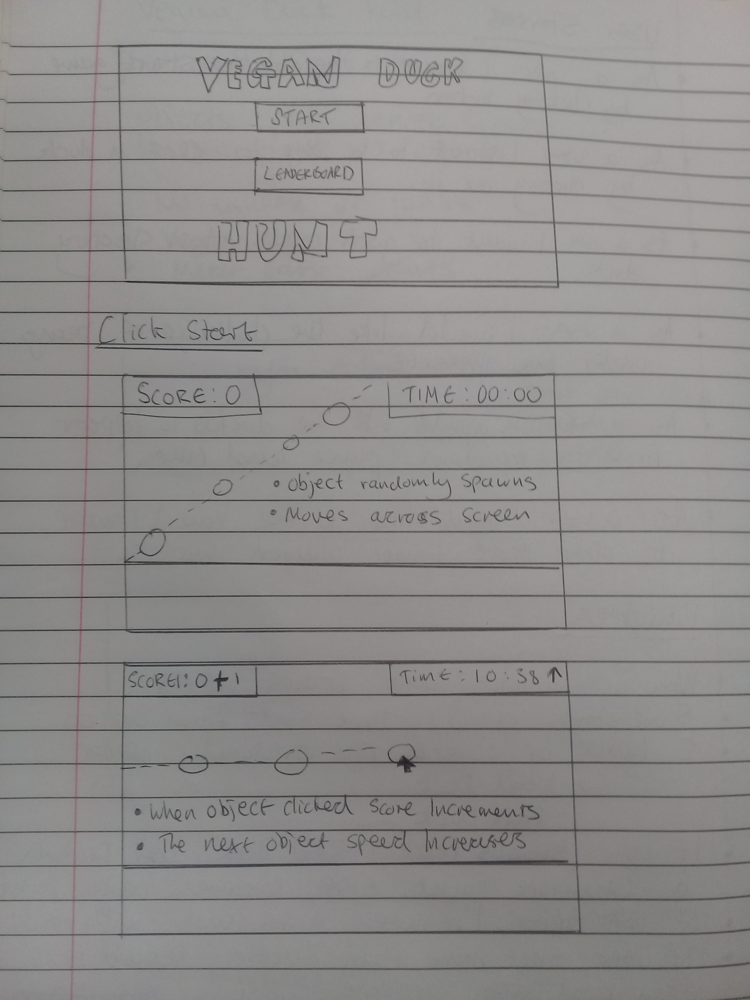
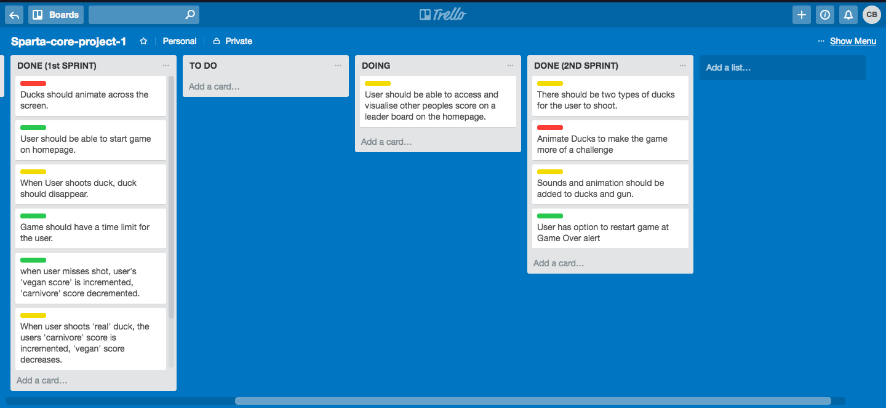
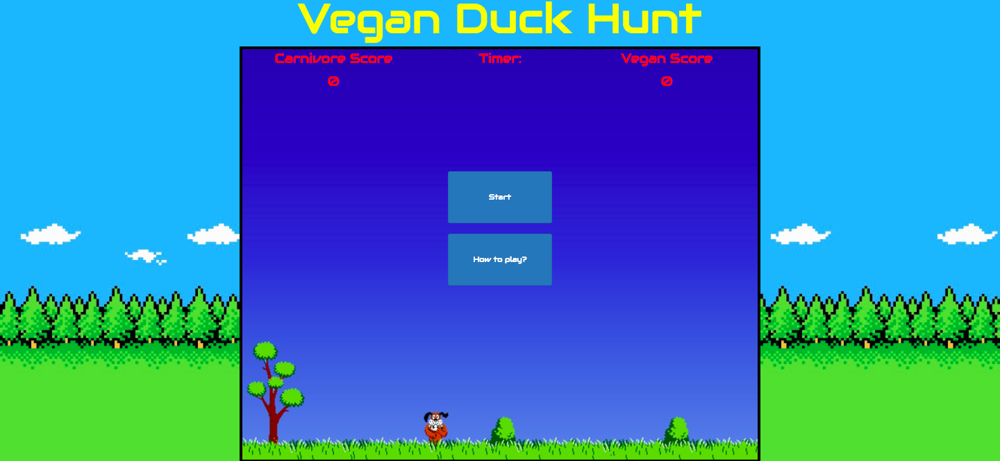
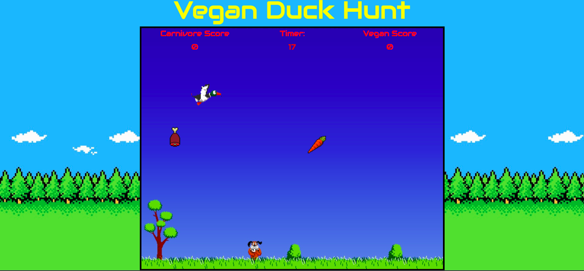

# sparta-core-project-1

# Vegan Duck Hunt

## Software
A JavaScript / Jquery game built using HTML with added bootstrap, and CSS.

## Installation
1. Go to https://github.com/cbryant93/sparta-core-project-1/tree/add-ons
2. Download Zip file
3. In pages folder, open index.html in browser.
4. Enjoy!

## Task Requirements
1. Build a browser based game.
2. Get project idea approved by trainers.
3. Include an instruction section explaining how to play the game.
4. A display message when the user has won, or display user score after the game has finished.

## Approach
### Game Idea
I wanted to create a game which had I knew could be realistically completed in the set amount time given based on my coding skills.

I decided to make a point in click game, due to learning all the core concepts behind this in the prior 2 weeks of learning.

My final Game idea was a spin-off of the famous retro game: 'Duck Hunt'. The spin-off detail was a modern twist where the user would have the option to still gain points from not killing the ducks, to keep everyone happy.

## Planning

### Wireframes
To get a clear idea of what I wanted my game to look like I decided to put pen to paper.



Drawing the wireframes helped me visualise the functions on the screen to see what functions would need to be appended where on the page.

### User Stories
Using my wireframes I went through the the different user journeys one may take when playing the game. I wrote down on paper what features would be needed to make a user friendly game.

## Sprints
For this project we were to use the agile methodology as a basis to our work style. To help follow work progress we used trello.



### Sprint 1
In sprint one we were to have a minimal viable product complete. This was a complete working game at its most basic design. All the key functions had to be working. In the picture above you can see what how I differentiated this.

### Issues in sprint 1
#### Create duck function
The main problem I had was spawning the targets. At first I didn't know how I was going to tackle this function. One idea I had was making an array of ducks and creating a loop where they all appear one by one. I realised this would be many lines of code of divs in the HTML containing ducks. I then realised I could create a div in Jquery, and somehow keep creating the div with a set interval, to appear on the page.

```javascript
function createDuck() {
  var duck = $('<div class="target duck" id="' + duckId + '"></div>');
```
#### Duck Movement

The next issues I had after this was making the targets move across the screen. I first researched CSS animation techniques, however this was hard to control in the JavaScript. I ended up using the Jquery function to edit CSS. However the divs did not animate the screen very well, so I discovered a function called animate.

```JavaScript
var moveDuck = setInterval(function() {
  duck.animate({
    left: '100vw' //Duck moves from the left
  }, 5000); //Speed ducks fly
```
#### Removing ducks

My third problem I had was when it came to producing the shoot the duck function. My code allowed for the user to click a duck and it would disappear, by targeting the div class. However when I did this It removed all the duck targets from the screen. To solve this problem I implemented code which would give each duck a unique ID.

```JavaScript
  var duck = $('<div class="target duck" id="' + duckId + '"></div>');
  duckId++;
```

### Sprint 2
After having a successful Sprint 1 with a basic working version of my game, I wanted to add some extra features to make the game more entertaining.

### Issues in Sprint 2

#### Animate Ducks

My biggest problem I encountered on sprint 2 was making the targets become more animated. I wanted to make the duck targets move in a way to make it more difficult for the user to get points. I decided I wanted them to do an up and down motion. I tried to implement a number of different methods to animate the targets. Firstly I thought about using keyframes in CSS however this overwrote my original left to right movement. I then tried editing the animate function in Jquery, although this limited the movements to the target to only go in one direction. My final idea was to target the position of the target:

```JavaScript
duck.css('top', duck.position().top + duckYPx) //Ducks move up
```
To then make the ducks move in an up and down motion I did:

```JavaScript
//Controls the ducks distance of movement up and down the Y axis
setInterval(() => {
  if (duckYDir) {
    // moves up
    duckYDir = !duckYDir;
    duckYPx -= 1;
  } else {
    // moves down
    duckYDir = !duckYDir
    duckYPx += 1.7;
  }

}, 400)
```
#### Randomizing what targets are spawned

After I created new types of targets, there was a problem where they would spawn at the same time, stacked on top of each other. I decided to tackle this by creating a function where I would give each target a number, and have another function randomly pick one of the functions. I used ideas from a previous rock, paper, scissors game to create this. I used .Math function to randomly pick a number between 1 - 3, and then use a switch statement to call a create function for the specific target.

```JavaScript
function duckSelect() {

  var randomSelect = Math.floor(Math.random() * 3); //Select random number between 0-2
  switch (randomSelect) {
    case 0:

      createMeat(); //if 0 create Meat target

      break;

    case 1:

      createCarrot(); //if 1 create Meat target

      break;

    case 2:

      createDuck(); //if 2 create Meat target

      break;

    default:
      console.log('nothing selected');

  }

}

```
## How to play
Aim of the game is to click and shoot targets which fly across the screen. However certain targets give different types of points.

If you are a vegan/vegetarian you may feel like you don't want to shoot birds, so you can shoot carrots instead to gain 3 'Vegan points', each missed shot also allows you to gain 1 'Vegan Point'.

If you enjoy shooting ducks, then you will gain 1 'Carnivore Point' doing this. You can also gain extra 3 'Carnivore Points' by clicking and shooting pieces of meat.

Gain as many points you can before the timer runs out!

## Finished product


Main screen


Click Start
